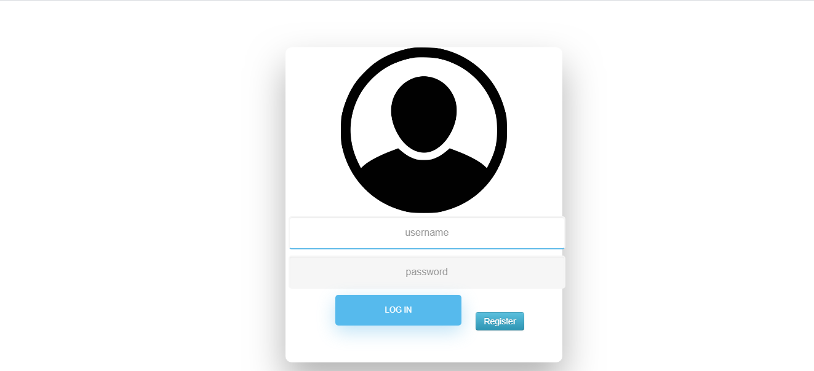
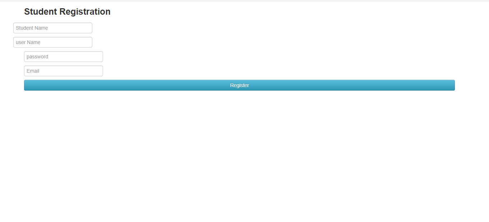
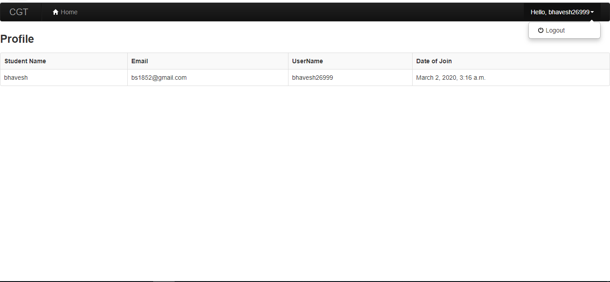
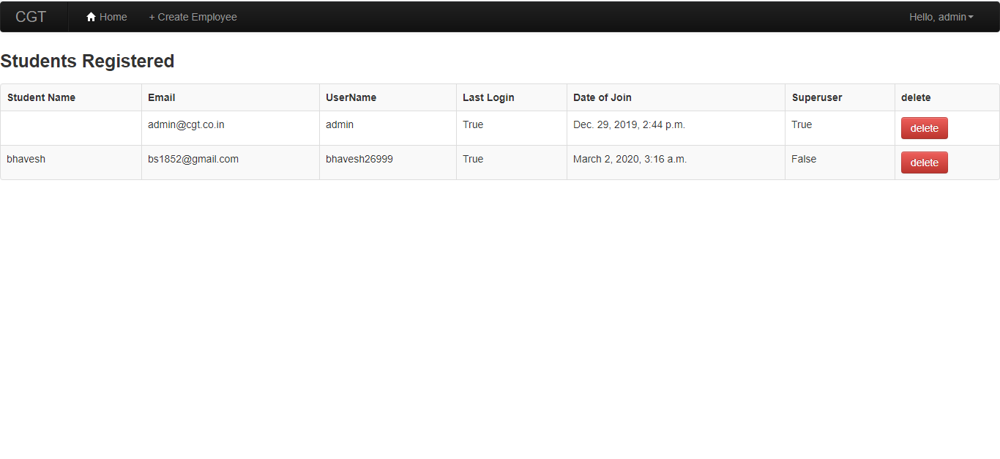
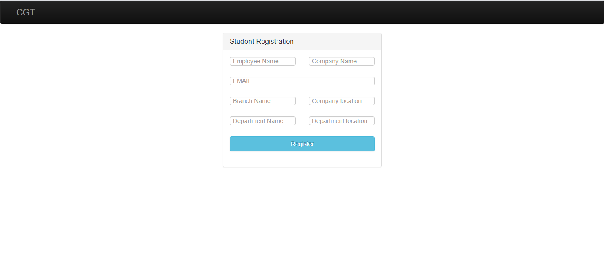

# Admin_Dashboard
🎁 Open student management and admin dashboard for colleges. 

- :ok_hand: Crisp UI
- :heartpulse: Intuitive
- :sparkler: Instant lookup
- :pencil2: Towards customisation

# ⚗️ Stability

**alpha** - highly volatile, core features not yet finished

# 🔥 Just Added Features

- Confirmation before deleting section
- Settings fully operationable
- Apply settings works for existing and non-existing db
- Instantly checks duplicate
- Admin and Student different logins

# 👟 Run instructions

``cd`` into /Admin_Dashboard if not already.

run the app.

```python
python manage.py runserver
```

**Super User password**

```python
User ID: admin 
password: cgt
```

## 🍳 Login

## 🍳 Admin Register

## 🍳 Student Dashboard

## 🍳 Admin Dashboard

## 🍳 Student Register



